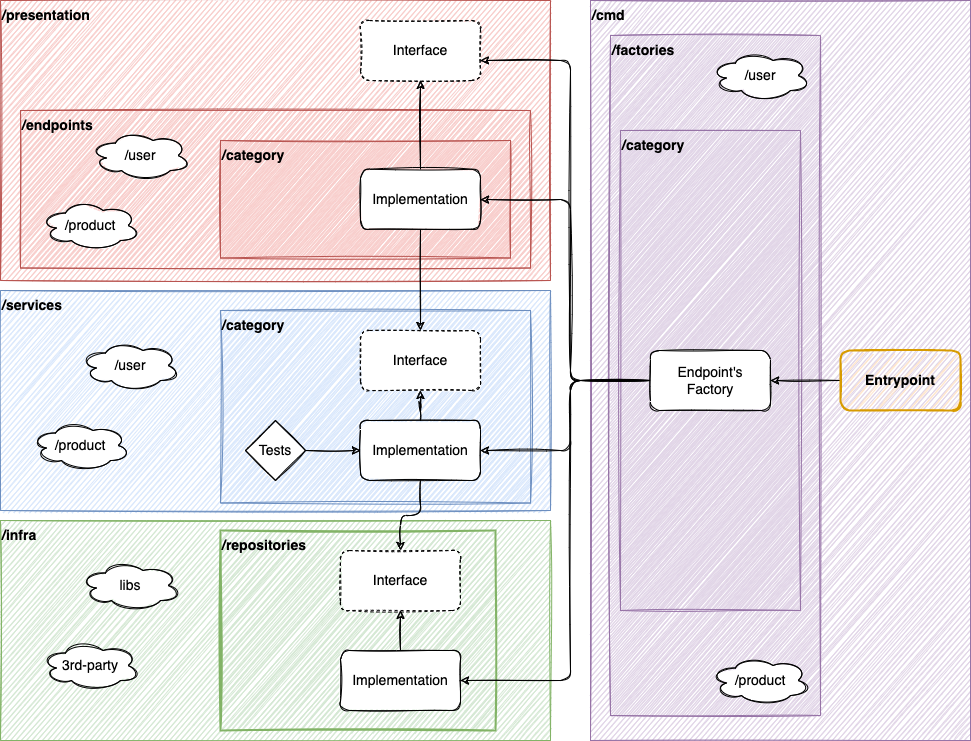

# .env file

Rename the `.env.copy` to `.env` and set the variables values according to your environment. They are pretty much mirrored with the `docker-compose.yaml` file.

Remember to run `source .env` to apply the variables into your terminal. This is going to be required for some commands.

# Infrastructure

We're using [docker-compose](https://docs.docker.com/compose/) to manage our infrastructure (as database and other services). After installing docker-compose in your machine, just run `docker-compose up -d`.

> If you want to read more about Docker and Docker-compose, check out my material at [Notion](https://cloudy-marsupial-788.notion.site/CI-CD-115134e2ddeb4c5bb9273912a235dd06).

## Relational Database

- DBMS: PostgreSQL
- Database name: `postgres` (default)
- Username: `postgres` (default)
- Password: `123456` (defined on `docker-compose.yaml`)
- Port: `5432` (default) mapped to `54321` on host
- A container's volume is stored `/.data/sqldb`
- We're using [DBeaver](https://dbeaver.io/) as an IDE to manage the database

# Folder structure

- `cmd`: Project's entrypoint
  - `factories`: Functions that create our endpoints ready-to-use, applying the DI and returning an Endpoint Service
    - `[resource]`: Each resource has its own directory
- `database`: All database-related files
  - `migrations`: Migrations
  - `.data`: Database volume (Not commited)
- `entities`: Entities structs
- `infra`: Lowest level of abstraction to services and tools
  - `repositores`: Repositories of entities and its interfaces
    - `[resource]`: Each resource has its own directory
      - `__mocks__`: Mocks and stubs for unit testing, related to the respective resource
- `presentation`: The highest layer, where we're going to find our endpoints
  - `endpoints`: Implementation of our endpoints, using our services and returning a HTTP Response
    - `[resource]`: Each resource has its own directory
- `services`: Services related to the project goal
  - `[resource]`: Each resource has its own directory

# Migrations (PostgreSQL)

We're using [golang-migrate](https://github.com/golang-migrate/migrate) to manage the migrations of our PSQL database. You can install the CLI by following the [lib's docs](https://github.com/golang-migrate/migrate/tree/master/cmd/migrate). They also provide an awesome documentation about how to use the CLI with an PostgreSQL database, which you can find [here](https://github.com/golang-migrate/migrate/blob/master/database/postgres/TUTORIAL.md).

All migrations are stored in the `/migrations` directory.
Every migration creates two files: `.up.sql` and `.down.sql`. They're the basic up/down migrations concept.

- Creating a new migration: `migrate create -ext sql -dir db/migrations -seq {migration_name}`
- Running migrations: `migrate -database ${POSTGRESQL_URL} -path database/migrations up`
- Rollback migrations: `migrate -database ${POSTGRESQL_URL} -path database/migrations down`

> Our migrations use variables from the .env file, so don't forget to setup your .env file and run `source .env` before using the migrations' commands

# Unit testing

We'll use the `testing` libraru in order to implement unit testing in Go. To do so, just create a file with the suffix `_test`, together/related to the module you want to test. For instance, let's say that we have a `hello.go` file implemeting some behavior (and we want to test it). So, we would create a `hello_test.go` file, implementing the tests.

- Run the unit tests: `go test -v ./...`
